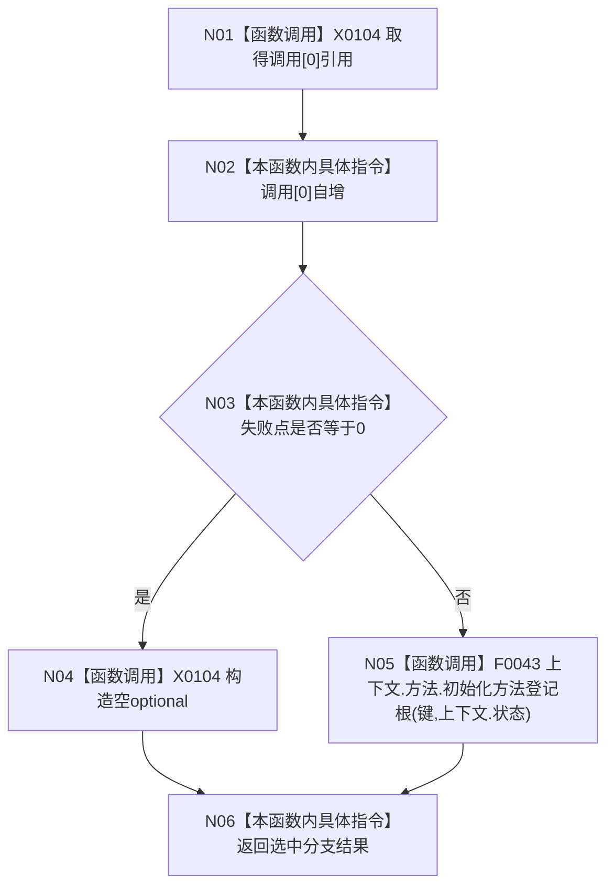

# CF-L5-0001 `入口端口方法登记根故障注入 lambda` 现状流程图

图类型：现状流程图
代码版本：`4b80f1617dd70ec7a19e1a34efa9da768dce8927`
源码 blob：`d2581161faef19cb494366ee32886ae2b12ee190`
覆盖文件：`海中鱼巣/启动.应用程序.ixx:208-213`
唯一根函数：F0120
完整签名：`std::optional<海中鱼巣::方法登记根材料> 海中鱼巣::运行入口端口合同自检()::<lambda@启动.应用程序.ixx:207>::operator()(std::uint64_t 键) const`
参数：键按值；返回：空 optional 故障注入或真实方法登记根初始化结果

项目调用 1：F0043，仅在失败点不为0时执行。闭包按引用捕获调用、失败点和上下文，只能在当前循环迭代内同步消费；计数表示端口进入次数，不表示真实服务调用次数。未解析调用 0。
