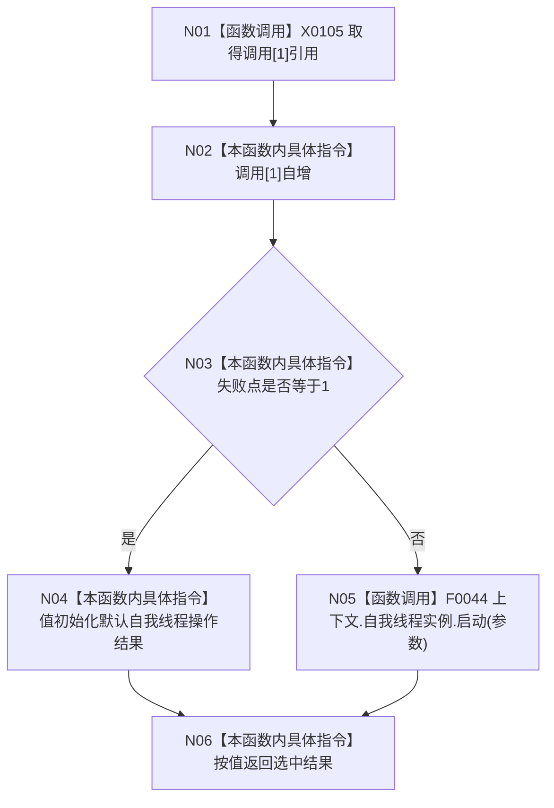

# CF-L5-0002 `入口端口自我线程启动故障注入 lambda` 现状流程图

图类型：现状流程图
代码版本：`a48a70b2d678dea64dd8228adb4f26f0badd9506`
覆盖文件：`海中鱼巣/启动.应用程序.ixx:211-216`
唯一根函数：F0121
完整签名：`海中鱼巣::自我线程操作结果 海中鱼巣::运行入口端口合同自检()::<lambda@启动.应用程序.ixx:211>::operator()(const 海中鱼巣::自我根需求初始化参数& 参数) const`
参数：参数为调用期只读借用；返回：默认失败注入结果或真实线程启动结果

项目调用 1：F0044，仅在失败点不为1时执行。注入结果为成功 false、复用 false、拒绝原因“无”，不能作为真实线程拒绝原因。引用捕获仅在同步不逃逸前提下有效。未解析调用 0。
