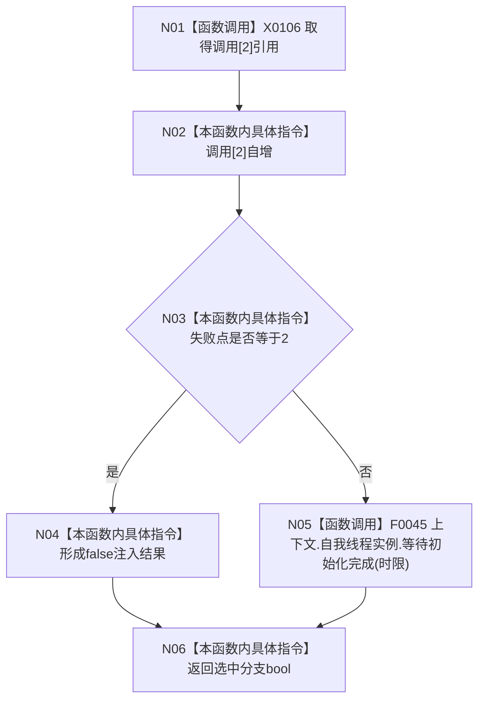

# CF-L5-0003 `入口端口等待初始化故障注入 lambda` 现状流程图

图类型：现状流程图
代码版本：`a48a70b2d678dea64dd8228adb4f26f0badd9506`
覆盖文件：`海中鱼巣/启动.应用程序.ixx:217-222`
唯一根函数：F0122
完整签名：`bool 海中鱼巣::运行入口端口合同自检()::<lambda@启动.应用程序.ixx:217>::operator()(std::chrono::milliseconds 时限) const`
参数：时限按值；返回：失败点2时 false，否则返回真实等待结果

项目调用 1：F0045，仅在失败点不为2时执行。注入分支不等待时间、不触碰线程状态，只模拟 false 返回。闭包引用只允许当前迭代内同步消费。未解析调用 0。
