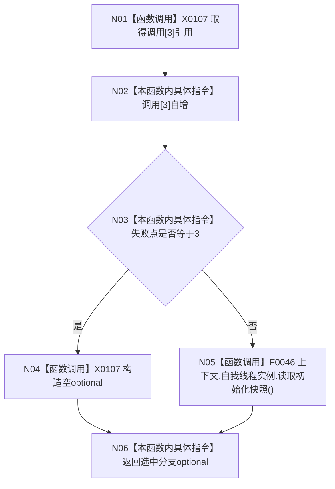

# CF-L5-0004 `入口端口读取初始化快照故障注入 lambda` 现状流程图

图类型：现状流程图
代码版本：`a48a70b2d678dea64dd8228adb4f26f0badd9506`
覆盖文件：`海中鱼巣/启动.应用程序.ixx:223-228`
唯一根函数：F0123
完整签名：`std::optional<海中鱼巣::自我线程初始化快照> 海中鱼巣::运行入口端口合同自检()::<lambda@启动.应用程序.ixx:223>::operator()() const`
参数：无；返回：空 optional 故障注入或真实初始化快照

项目调用 1：F0046，仅在失败点不为3时执行。返回 optional 自持快照值，不暴露线程内部引用；闭包引用仅允许本轮同步消费。未解析调用 0。
