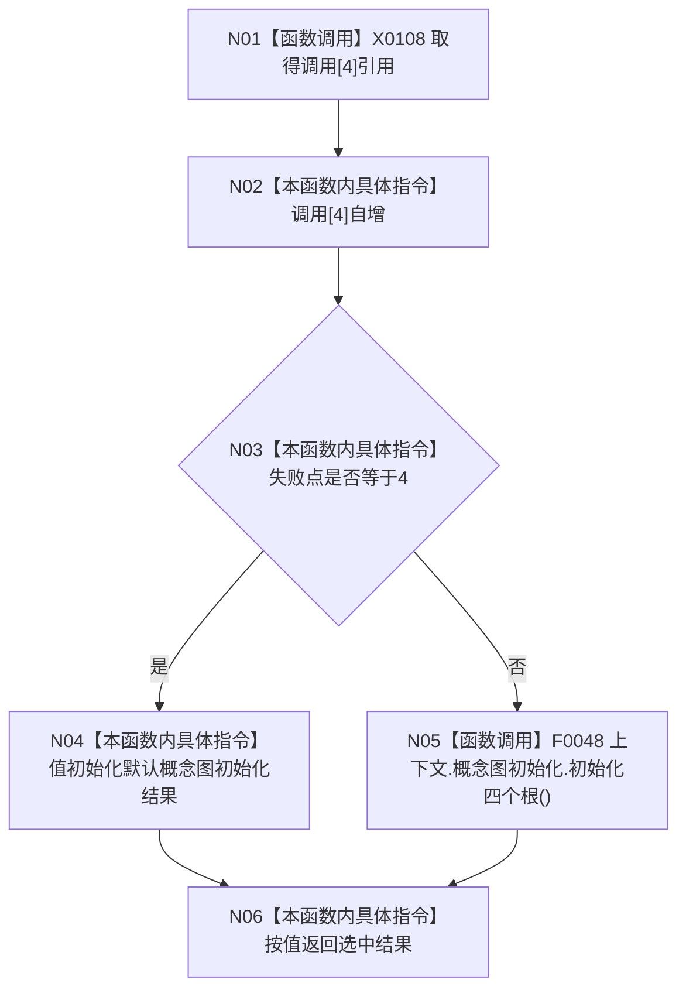

# CF-L5-0005 `入口端口概念图四根故障注入 lambda` 现状流程图

图类型：现状流程图
代码版本：`4b80f1617dd70ec7a19e1a34efa9da768dce8927`
源码 blob：`d2581161faef19cb494366ee32886ae2b12ee190`
覆盖文件：`海中鱼巣/启动.应用程序.ixx:232-237`
唯一根函数：F0124
完整签名：`海中鱼巣::概念图初始化结果 海中鱼巣::运行入口端口合同自检()::<lambda@启动.应用程序.ixx:231>::operator()() const`
参数：无；返回：默认失败形状或真实四根初始化结果

项目调用 1：F0048。当前六轮路由中，失败点0–3在更早端口收口，失败点4只注入，只有失败点5会真实调用 F0048。默认结果没有具名失败项或错误码。未解析调用 0。
