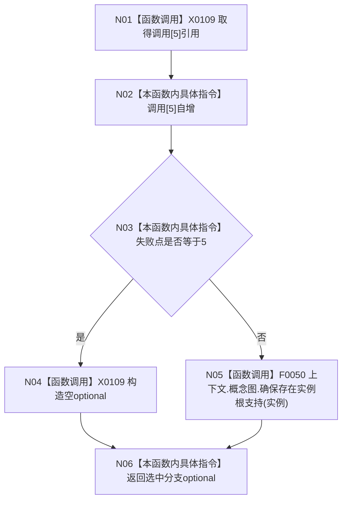

# CF-L5-0006 `入口端口存在根支持故障注入 lambda` 现状流程图

图类型：现状流程图
代码版本：`a48a70b2d678dea64dd8228adb4f26f0badd9506`
覆盖文件：`海中鱼巣/启动.应用程序.ixx:235-240`
唯一根函数：F0125
完整签名：`std::optional<海中鱼巣::节点句柄> 海中鱼巣::运行入口端口合同自检()::<lambda@启动.应用程序.ixx:235>::operator()(海中鱼巣::节点句柄 实例) const`
参数：实例句柄按值；返回：空 optional 故障注入或真实存在根支持句柄

项目调用 1：F0050，仅在失败点不为5时执行。句柄只复制三个标量，不拥有节点；注入分支不校验句柄，也不触碰概念图。未解析调用 0。
