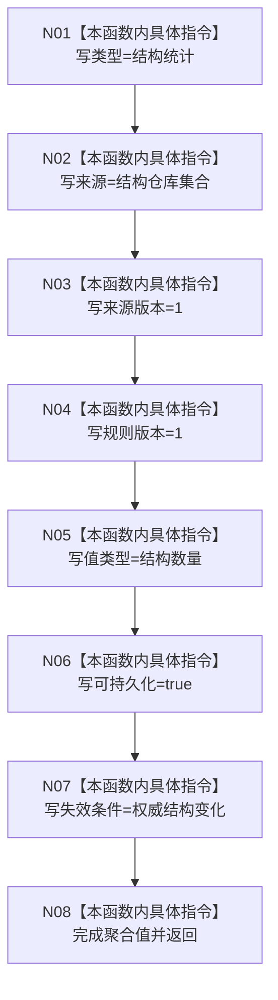

# CF-L5-0007 `数据库审计固定命名空间 lambda` 现状流程图

图类型：现状流程图
代码版本：`a48a70b2d678dea64dd8228adb4f26f0badd9506`
覆盖文件：`海中鱼巣/启动.应用程序.ixx:249-251`
唯一根函数：F0126
完整签名：`海中鱼巣::缓存命名空间 海中鱼巣::运行入口端口合同自检()::<lambda@启动.应用程序.ixx:249>::operator()() const`
参数：无；返回：固定结构统计缓存命名空间值

项目调用 0，外部调用 0，未解析调用 0。无捕获闭包可重复并发调用，每次返回相同纯值 DTO；它是自检替身，不读取真实统计服务版本。
