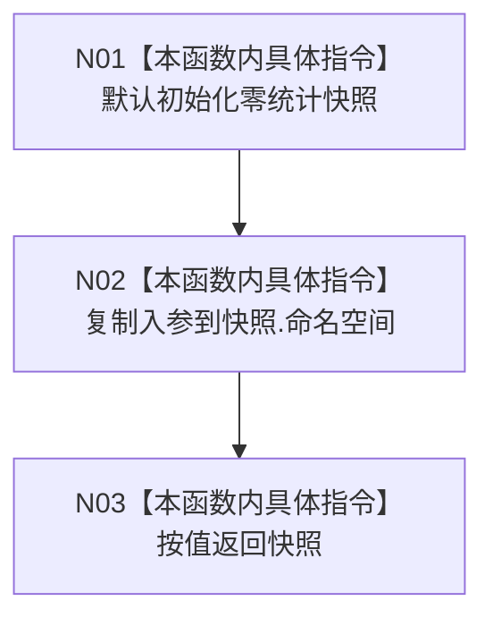

# CF-L5-0008 `数据库审计零统计快照 lambda` 现状流程图

图类型：现状流程图
代码版本：`4b80f1617dd70ec7a19e1a34efa9da768dce8927`
源码 blob：`d2581161faef19cb494366ee32886ae2b12ee190`
覆盖文件：`海中鱼巣/启动.应用程序.ixx:255-259`
唯一根函数：F0127
完整签名：`海中鱼巣::结构统计快照 海中鱼巣::运行入口端口合同自检()::<lambda@启动.应用程序.ixx:254>::operator()(海中鱼巣::缓存命名空间 命名空间) const`
参数：命名空间按值；返回：回显命名空间且三个统计数为0的快照

项目调用 0，外部调用 0，未解析调用 0。函数不读取真实仓库；零计数既可能表示空仓库，也可能仅表示本替身未读取，不能宣称真实统计成功。
