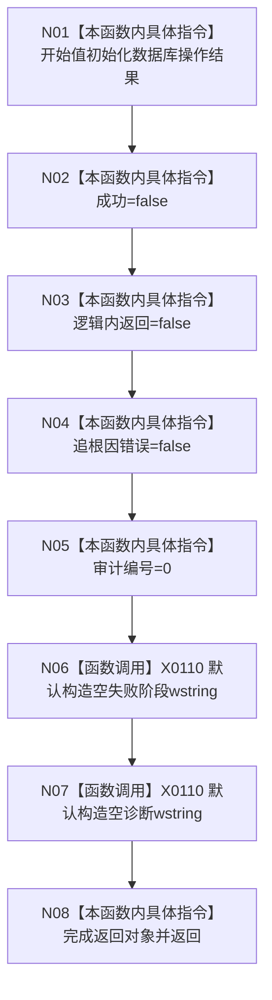

# CF-L5-0009 `数据库审计写入失败 lambda` 现状流程图

图类型：现状流程图
代码版本：`4b80f1617dd70ec7a19e1a34efa9da768dce8927`
源码 blob：`d2581161faef19cb494366ee32886ae2b12ee190`
覆盖文件：`海中鱼巣/启动.应用程序.ixx:260`
唯一根函数：F0128
完整签名：`海中鱼巣::数据库操作结果 海中鱼巣::运行入口端口合同自检()::<lambda@启动.应用程序.ixx:259>::operator()(const 海中鱼巣::结构统计快照& 快照, std::wstring 说明) const`
参数：快照为未读取的 const 借用，说明按值但未读取；返回：全默认数据库操作失败结果

项目调用 0。X0110 是两个 wstring 子对象的构造/析构和按值说明生命周期边界。函数不写数据库、不写日志、不读取两个输入，只以成功 false 驱动上层写入失败路由。未解析调用 0。
