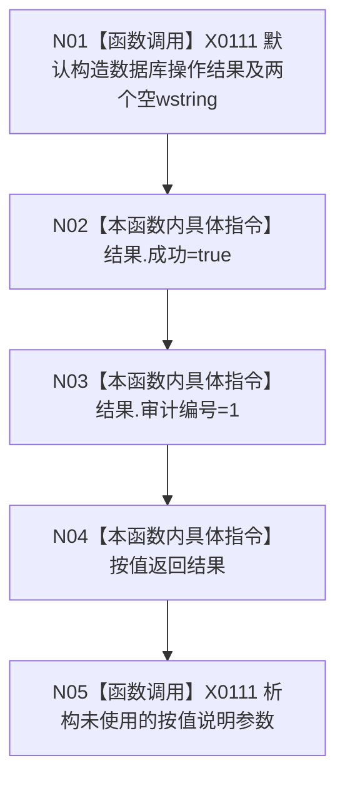

# CF-L5-0010 `数据库审计伪写入成功 lambda` 现状流程图

图类型：现状流程图
代码版本：`4b80f1617dd70ec7a19e1a34efa9da768dce8927`
源码 blob：`d2581161faef19cb494366ee32886ae2b12ee190`
覆盖文件：`海中鱼巣/启动.应用程序.ixx:270-275`
唯一根函数：F0129
完整签名：`海中鱼巣::数据库操作结果 海中鱼巣::运行入口端口合同自检()::<lambda@启动.应用程序.ixx:269>::operator()(const 海中鱼巣::结构统计快照& 快照, std::wstring 说明) const`
参数：源码两个参数均未具名且未读取；返回：成功 true、审计编号1的本地 DTO

项目调用 0。该自检替身不读取快照/说明、不写数据库、不写日志，只制造后续读回不一致所需的“写入成功”形状；不得登记为真实 SQL 成功。未解析调用 0。
