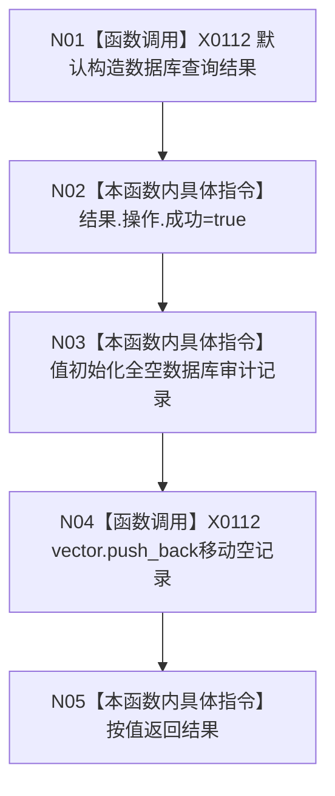

# CF-L5-0011 `数据库审计空记录查询 lambda` 现状流程图

图类型：现状流程图
代码版本：`a48a70b2d678dea64dd8228adb4f26f0badd9506`
覆盖文件：`海中鱼巣/启动.应用程序.ixx:273-278`
唯一根函数：F0130
完整签名：`海中鱼巣::数据库查询结果 海中鱼巣::运行入口端口合同自检()::<lambda@启动.应用程序.ixx:273>::operator()(std::size_t 上限) const`
参数：源码参数未具名且完全忽略；返回：操作成功且包含一条全默认审计记录的结果

项目调用 0。函数忽略上限，任意输入都尝试返回恰好一条编号/版本/统计/字符串全默认记录，用于制造读回不一致；不能解释为真实查询成功。未解析调用 0。
