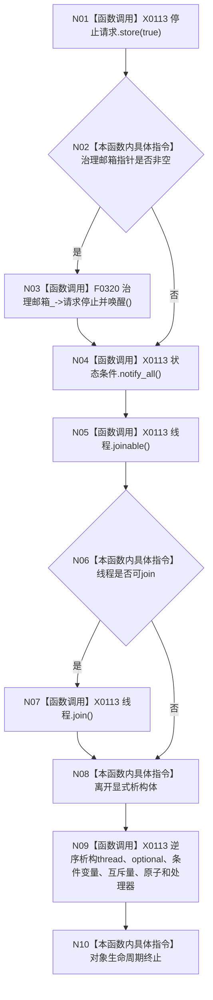

# CF-L5-0012 `自我线程::~自我线程` 现状流程图

图类型：现状流程图
代码版本：`a48a70b2d678dea64dd8228adb4f26f0badd9506`
覆盖文件：`海中鱼巣/线程/自我线程.ixx:124-133`，隐式成员析构依据 `446-467`
唯一根函数：F0131
完整签名：`海中鱼巣::自我线程::~自我线程() noexcept`
参数：无显式参数；返回：无；效果：请求停止、唤醒邮箱和条件变量、join 工作线程并逆序析构成员

项目调用 1：F0320；其结构化停止结果被显式丢弃。thread、atomic、condition_variable 与标准成员生命周期登记为 X0113。析构返回前会 join 可连接线程，但正确性仍依赖工作线程能被停止请求和邮箱唤醒驱动退出。未解析调用 0。
