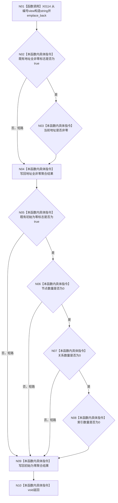

# CF-L5-0013 `入口隔离第一观察回调 lambda` 现状流程图

图类型：现状流程图
代码版本：`a48a70b2d678dea64dd8228adb4f26f0badd9506`
覆盖文件：`海中鱼巣/启动.应用程序.ixx:327-333`
唯一根函数：F0132
完整签名：`void 海中鱼巣::运行入口隔离合同自检()::<lambda@启动.应用程序.ixx:327>::operator()(std::string_view 编号, std::uintptr_t 地址, 海中鱼巣::入口初始化自检初始计数 计数) const`
参数：编号为非拥有视图、地址为观察值、初始计数按值；返回：void

项目调用 0。X0114 汇总 string 构造、vector emplace 和可能重分配。编号被立即复制；地址不解引用、不保存。非零地址不证明析构配对、live_count 回零或跨项无引用。未解析调用 0。
