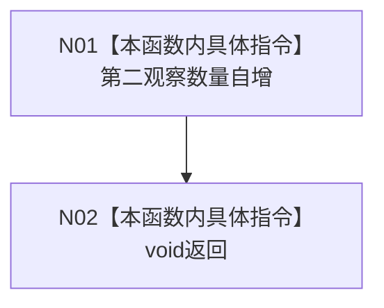

# CF-L5-0014 `入口隔离第二观察回调 lambda` 现状流程图

图类型：现状流程图
代码版本：`4b80f1617dd70ec7a19e1a34efa9da768dce8927`
源码 blob：`d2581161faef19cb494366ee32886ae2b12ee190`
覆盖文件：`海中鱼巣/启动.应用程序.ixx:353-354`
唯一根函数：F0133
完整签名：`void 海中鱼巣::运行入口隔离合同自检()::<lambda@启动.应用程序.ixx:352>::operator()(std::string_view 编号, std::uintptr_t 地址, 海中鱼巣::入口初始化自检初始计数 计数) const`
参数：源码三个参数均未具名且未读取；返回：void

项目调用 0，外部调用 0，未解析调用 0。闭包只按引用捕获观察数量；计数14只证明回调进入14次，不验证编号、地址、初始状态或生命周期隔离。
