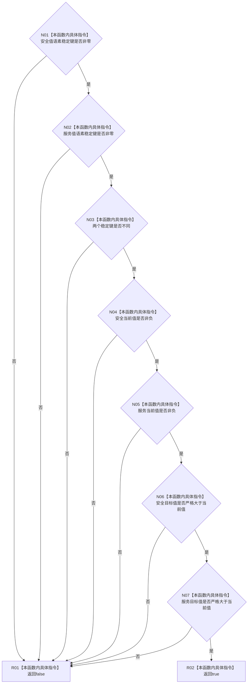

# CF-L5-0015 `自我根需求初始化参数::有效` 现状流程图

图类型：现状流程图
代码版本：`a48a70b2d678dea64dd8228adb4f26f0badd9506`
覆盖文件：`海中鱼巣/领域/初始化.需求.ixx:28-36`
唯一根函数：F0134
完整签名：`bool 海中鱼巣::自我根需求初始化参数::有效() const`
参数：无；返回：七项标量前置全部满足时 true

项目调用 0，外部调用 0，未解析调用 0。短路顺序严格为两个键、键不同、两个当前值、两个目标关系；false 不携带失败项。
