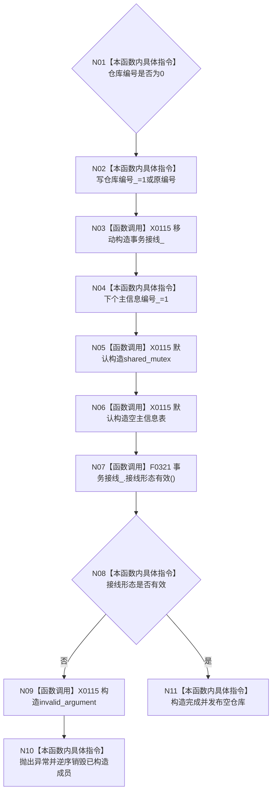

# CF-L5-0016 `主信息仓库::主信息仓库` 现状流程图

图类型：现状流程图
代码版本：`a48a70b2d678dea64dd8228adb4f26f0badd9506`
覆盖文件：`海中鱼巣/核心/主信息仓库.cpp:31-36`，成员顺序依据 `主信息仓库.h:137-141`
唯一根函数：F0135
完整签名：`海中鱼巣::主信息仓库::主信息仓库(std::uint64_t 仓库编号 = 1, 海中鱼巣::结构事务接线 接线 = {})`
参数：仓库编号按值，接线按值后移动；返回：成功构造对象或抛出异常

项目调用 1：F0321。仓库编号0被静默归一为1；接线 shared_ptr 所有权从值参数移入成员。形态有效只证明全空或字段全有，不证明事务域当前可用。未解析调用 0。
