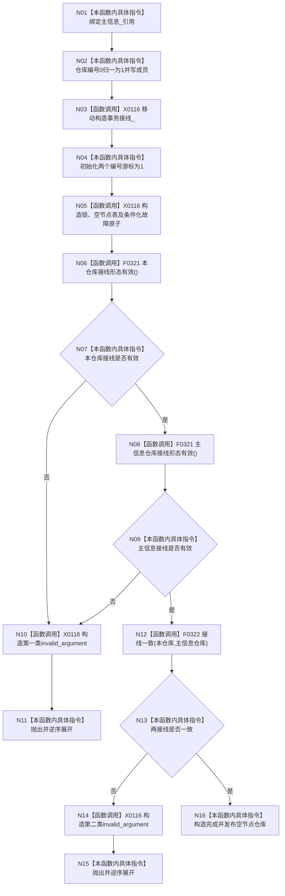

# CF-L5-0017 `节点仓库::节点仓库` 现状流程图

图类型：现状流程图
代码版本：`a48a70b2d678dea64dd8228adb4f26f0badd9506`
覆盖文件：`海中鱼巣/核心/节点仓库.cpp:43-51`，成员顺序依据 `节点仓库.h:153-161`
唯一根函数：F0136
完整签名：`海中鱼巣::节点仓库::节点仓库(const 海中鱼巣::主信息仓库& 主信息, std::uint64_t 仓库编号 = 1, 海中鱼巣::结构事务接线 接线 = {})`
参数：主信息仓库为非拥有 const 借用，编号和接线按值；返回：成功构造对象或抛出异常

项目调用 2 个唯一身份：F0321（两个调用点）和 F0322。主信息_ 仅为引用，必须比节点仓库寿命更长。接线一致不比较五个函数指针。未解析调用 0。
