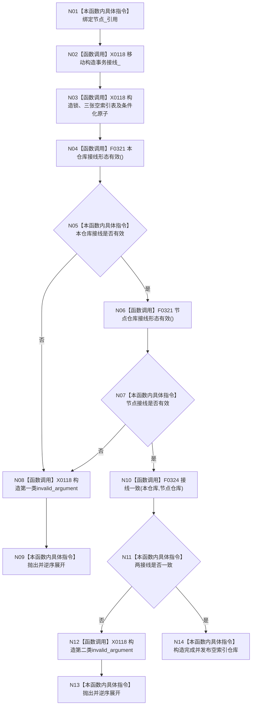

# CF-L5-0019 `索引仓库::索引仓库` 现状流程图

图类型：现状流程图
代码版本：`a48a70b2d678dea64dd8228adb4f26f0badd9506`
覆盖文件：`海中鱼巣/核心/索引仓库.cpp:92-100`，成员顺序依据 `索引仓库.h:122-130`
唯一根函数：F0138
完整签名：`海中鱼巣::索引仓库::索引仓库(const 海中鱼巣::节点仓库& 节点, 海中鱼巣::结构事务接线 接线 = {})`
参数：节点仓库为非拥有 const 借用，接线按值后移动；返回：成功构造或抛出异常

## 项目源码调用合同

| 调用节点 | 被调函数 | 参数 / 输入绑定 | 结果 / 输出绑定 | 调用条件与类型 | 被调图 |
| --- | --- | --- | --- | --- | --- |
| N04 | F0321 `bool 海中鱼巣::结构事务接线::接线形态有效() const` | 隐式 `this=&事务接线_` | 本仓库形态条件 | 全部成员初始化成功后；直接 const 成员调用 | [CF-L6-0001](../L6/CF-L6-0001_结构事务接线接线形态有效_现状流程图.md) |
| N06 | F0321 `bool 海中鱼巣::结构事务接线::接线形态有效() const` | 隐式 `this=&节点_.事务接线_` | 节点仓库形态条件 | N04 返回 `true`；`||` 短路后的直接 const 成员调用 | [CF-L6-0001](../L6/CF-L6-0001_结构事务接线接线形态有效_现状流程图.md) |
| N10 | F0324 `bool 海中鱼巣::{匿名命名空间@索引仓库.cpp}::接线一致(const 海中鱼巣::结构事务接线& 左, const 海中鱼巣::结构事务接线& 右)` | `左=事务接线_`；`右=节点_.事务接线_` | 一致条件 | N04、N06 均为 `true`；直接内部链接自由函数调用 | [CF-L6-0004](../L6/CF-L6-0004_索引仓库接线一致_现状流程图.md) |

项目调用 2 个唯一身份：F0321（两个调用点）和 F0324。节点_ 不延长节点仓库寿命；接线一致不比较五个回调函数指针，也不证明共享状态控制块相同。未解析调用 0。
