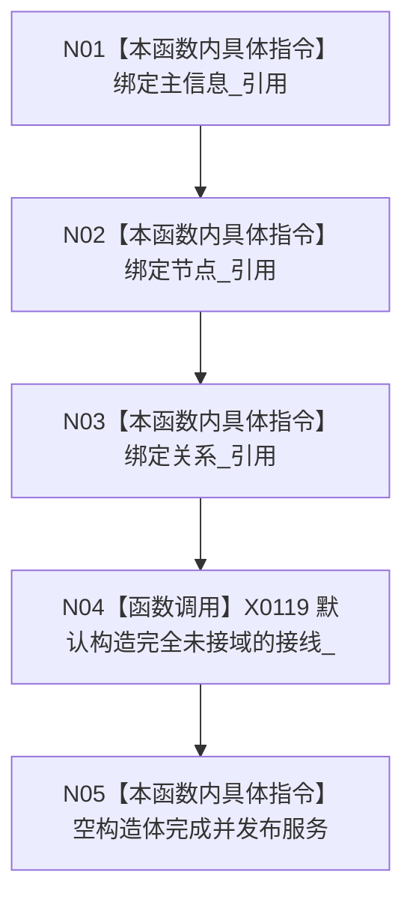

# CF-L5-0020 `存在服务::存在服务` 三仓库构造现状流程图

图类型：现状流程图
代码版本：`a48a70b2d678dea64dd8228adb4f26f0badd9506`
覆盖文件：`海中鱼巣/领域/存在服务.h:42-44`，成员顺序依据 `161-164`
唯一根函数：F0139
完整签名：`海中鱼巣::存在服务::存在服务(海中鱼巣::主信息仓库& 主信息, 海中鱼巣::节点仓库& 节点, 海中鱼巣::关系仓库& 关系)`
参数：三个仓库均为非拥有可变引用；返回：构造服务对象

项目调用 0。三仓库必须全部长于服务；此重载把服务接线留空，即使仓库已经接入事务域也不会自动继承。构造不验证三仓库来自同一装配。未解析调用 0。
