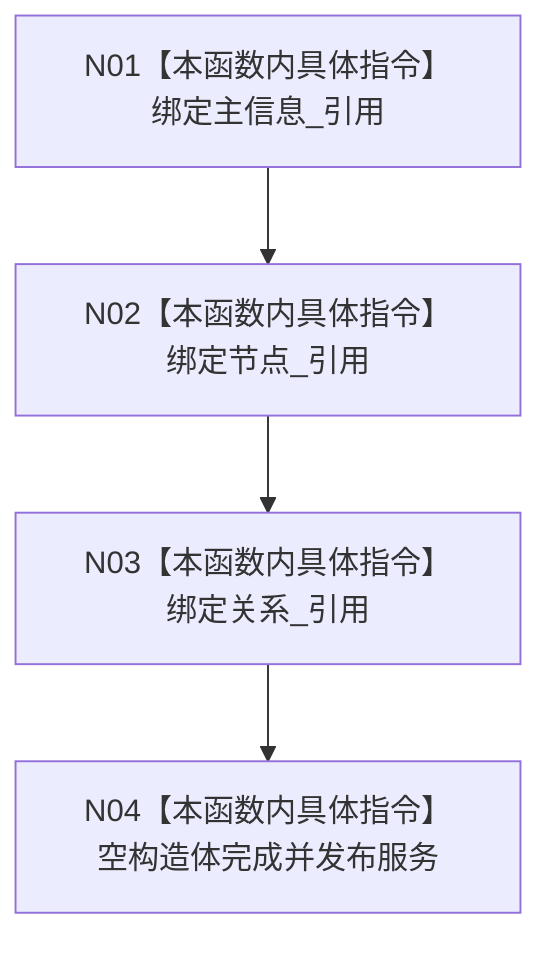

# CF-L5-0021 `场景服务::场景服务` 现状流程图

图类型：现状流程图
代码版本：`a48a70b2d678dea64dd8228adb4f26f0badd9506`
覆盖文件：`海中鱼巣/领域/场景服务.h:12-14`，成员顺序依据 `62-64`
唯一根函数：F0140
完整签名：`海中鱼巣::场景服务::场景服务(海中鱼巣::主信息仓库& 主信息, 海中鱼巣::节点仓库& 节点, 海中鱼巣::关系仓库& 关系)`
参数：三个仓库均为非拥有可变引用；返回：构造服务对象

项目调用 0，外部调用 0，未解析调用 0。构造不创建场景或任何仓库事实，也不验证三个仓库的编号、事务域或锚定关系。
