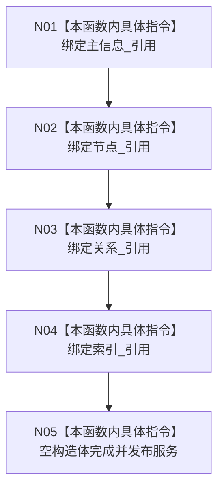

# CF-L5-0025 `语素服务::语素服务` 构造现状流程图

图类型：现状流程图
代码版本：`a48a70b2d678dea64dd8228adb4f26f0badd9506`
覆盖文件：`海中鱼巣/领域/语素服务.h:53-55`，成员顺序依据 `390-393`
唯一根函数：F0144
完整签名：`海中鱼巣::语素服务::语素服务(海中鱼巣::主信息仓库& 主信息, 海中鱼巣::节点仓库& 节点, 海中鱼巣::关系仓库& 关系, 海中鱼巣::索引仓库& 索引)`
参数：四个仓库均为非拥有可变引用；返回：构造服务对象

项目调用、外部边界和未解析调用均为 0。构造不创建语素或主键，不验证索引仓库内部节点锚点与参数 `节点` 相同；四个仓库必须全部长于服务。
