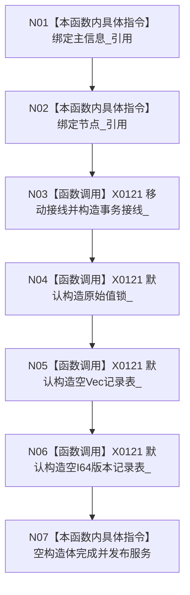

# CF-L5-0026 `特征值服务::特征值服务` 构造现状流程图

图类型：现状流程图
代码版本：`a48a70b2d678dea64dd8228adb4f26f0badd9506`
覆盖文件：`海中鱼巣/领域/特征值服务.h:196-198`，成员顺序依据 `711-716`
唯一根函数：F0145
完整签名：`海中鱼巣::特征值服务::特征值服务(海中鱼巣::主信息仓库& 主信息, 海中鱼巣::节点仓库& 节点, 海中鱼巣::结构事务接线 接线 = {})`
参数：两个仓库为非拥有可变引用，接线按值传入；返回：构造服务对象

项目调用 0，外部边界 X0121，未解析调用 0。构造不验证接线形态、事务域与仓库域一致性；锁仅保护服务自有的两张原始值侧表，不能证明仓库复合写原子。
