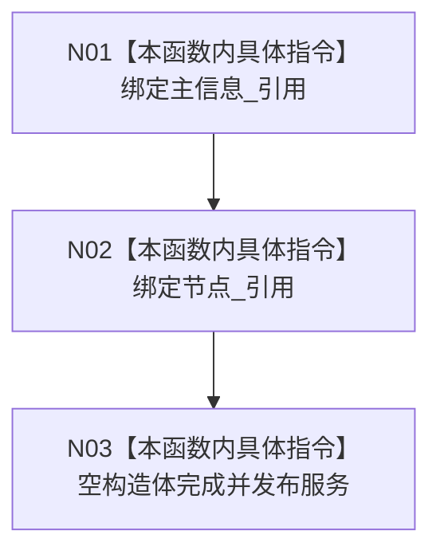

# CF-L5-0027 `因果服务::因果服务` 构造现状流程图

图类型：现状流程图
代码版本：`a48a70b2d678dea64dd8228adb4f26f0badd9506`
覆盖文件：`海中鱼巣/领域/因果服务.h:40-42`，成员顺序依据 `140-141`
唯一根函数：F0146
完整签名：`海中鱼巣::因果服务::因果服务(海中鱼巣::主信息仓库& 主信息, 海中鱼巣::节点仓库& 节点)`
参数：两个仓库均为非拥有可变引用；返回：构造服务对象

项目调用、外部边界和未解析调用均为 0。构造不创建因果引用或动态材料，也不验证节点仓库内部主信息锚点与参数 `主信息` 相同；两个仓库必须长于服务。
