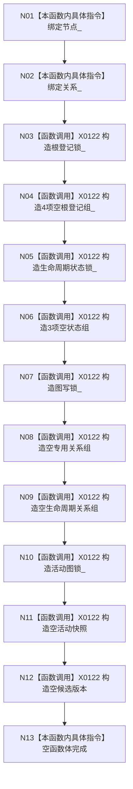

# CF-L5-0028 `概念图服务::概念图服务` 构造现状流程图

代码版本：`a48a70b2d678dea64dd8228adb4f26f0badd9506`；图类型：现状流程图
唯一根函数：F0147；文件：`海中鱼巣/领域/概念图服务.h:795-797,4427-4438`
完整签名：`海中鱼巣::概念图服务::概念图服务(海中鱼巣::节点仓库& 节点, 海中鱼巣::关系仓库& 关系)`；返回：构造服务对象

项目调用 0，外部边界 X0122，未解析 0。构造完成仅表示空缓存和锁已建立，不表示四根或活动图已初始化。
