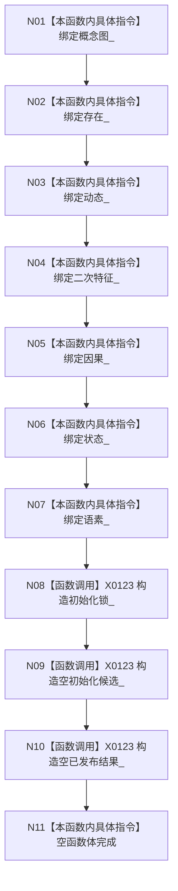

# CF-L5-0029 `概念图初始化服务::概念图初始化服务` 构造现状流程图

代码版本：`a48a70b2d678dea64dd8228adb4f26f0badd9506`；图类型：现状流程图
唯一根函数：F0148；文件：`海中鱼巣/领域/初始化.概念图.ixx:81-96,264-273`
完整签名：`海中鱼巣::概念图初始化服务::概念图初始化服务(海中鱼巣::概念图服务& 概念图, 海中鱼巣::存在服务& 存在, 海中鱼巣::动态服务& 动态, 海中鱼巣::二次特征服务& 二次特征, 海中鱼巣::因果服务& 因果, 海中鱼巣::状态服务& 状态, 海中鱼巣::语素服务& 语素)`；返回：构造服务对象

项目调用 0，外部边界 X0123，未解析 0。七个依赖必须长于本服务；实例锁不能阻止另一初始化服务实例并发初始化同一底层结构。
