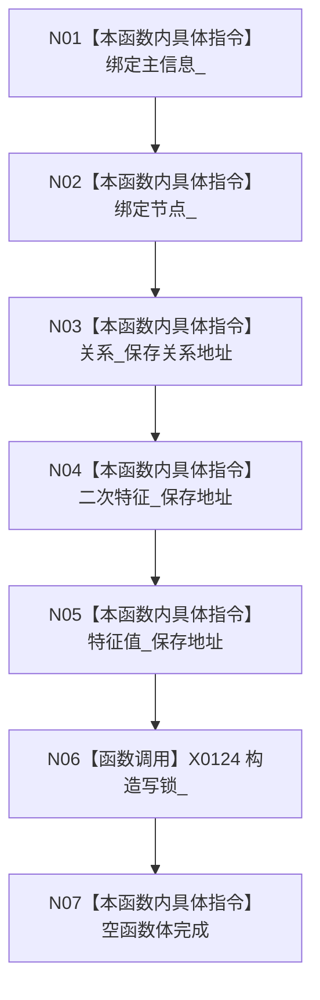

# CF-L5-0030 `特征服务::特征服务` 完整构造现状流程图

代码版本：`a48a70b2d678dea64dd8228adb4f26f0badd9506`；图类型：现状流程图
唯一根函数：F0149；文件：`海中鱼巣/领域/特征服务.h:212-214,1291-1296`
完整签名：`海中鱼巣::特征服务::特征服务(海中鱼巣::主信息仓库& 主信息, 海中鱼巣::节点仓库& 节点, 海中鱼巣::关系仓库& 关系, 海中鱼巣::二次特征服务& 二次特征, 海中鱼巣::特征值服务& 特征值)`；返回：构造服务对象

项目调用 0，外部边界 X0124，未解析 0。五个依赖均为非拥有引用或观察指针；构造不验证跨服务仓库链同源。
