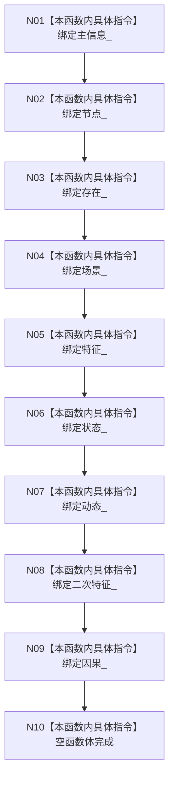

# CF-L5-0031 `世界服务::世界服务` 构造现状流程图

图类型：现状流程图
代码版本：`a48a70b2d678dea64dd8228adb4f26f0badd9506`
覆盖文件：`海中鱼巣/领域/世界服务.h:32-37`，成员顺序依据 `105-113`
唯一根函数：F0150
完整签名：`海中鱼巣::世界服务::世界服务(海中鱼巣::主信息仓库& 主信息, 海中鱼巣::节点仓库& 节点, 海中鱼巣::存在服务& 存在, 海中鱼巣::场景服务& 场景, 海中鱼巣::特征服务& 特征, 海中鱼巣::状态服务& 状态, 海中鱼巣::动态服务& 动态, 海中鱼巣::二次特征服务& 二次特征, 海中鱼巣::因果服务& 因果)`
参数：九个非拥有可变引用；返回结果：构造服务对象

项目调用、外部边界、未解析调用均为 0。构造不创建世界结构；九项依赖必须长于本服务。
