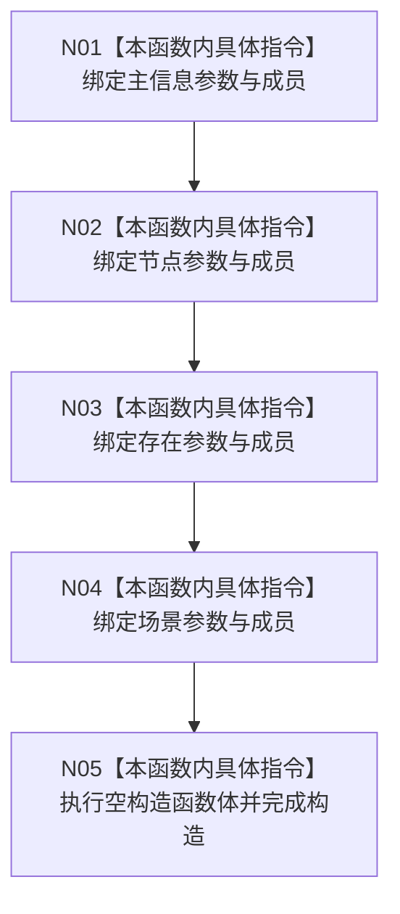

# CF-L5-0031 `世界服务::世界服务` 构造现状流程图

图类型：现状流程图
代码版本：`0a93526882cb33c61c2fbb04ecad1aeaddcfe225`
当前工作区复核基线：`ece29318f80cad2ce7a4abce9b009c60cd4cdfdd`
源码 blob：`75494ac696f3fbe3223bb966dab6dee39e4c5409`
覆盖文件：`海中鱼巣/领域/世界服务.h:13-15`，成员顺序依据 `41-44`
唯一根函数：F0150
完整签名：`海中鱼巣::世界服务::世界服务(海中鱼巣::主信息仓库& 主信息, 海中鱼巣::节点仓库& 节点, 海中鱼巣::存在服务& 存在, 海中鱼巣::场景服务& 场景)`
参数：四个非拥有可变引用；返回结果：构造函数无返回值，成功后形成绑定四项依赖的服务对象
不得作为施工许可：是
不得宣称：构造完成等于世界结构已经创建或初始化

项目调用、外部边界、未解析调用均为 0。构造不创建世界结构；四项依赖必须长于本服务。当前类不再保存特征、状态、动态、二次特征或因果服务引用。
