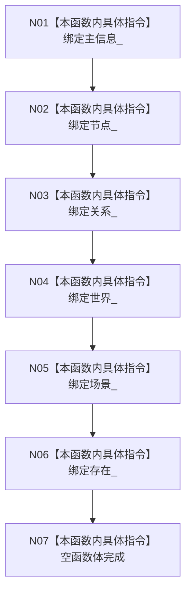

# CF-L5-0032 `世界树初始化服务::世界树初始化服务` 构造现状流程图

图类型：现状流程图
代码版本：`a48a70b2d678dea64dd8228adb4f26f0badd9506`
覆盖文件：`海中鱼巣/领域/初始化.世界树.ixx:45-48`，成员顺序依据 `151-156`
唯一根函数：F0151
完整签名：`海中鱼巣::世界树初始化服务::世界树初始化服务(海中鱼巣::主信息仓库& 主信息, 海中鱼巣::节点仓库& 节点, 海中鱼巣::关系仓库& 关系, 海中鱼巣::世界服务& 世界, 海中鱼巣::场景服务& 场景, 海中鱼巣::存在服务& 存在)`
参数：六个非拥有可变引用；返回结果：构造服务对象

项目调用、外部边界、未解析调用均为 0。构造不初始化世界树，也不建立锁、幂等缓存或共同事务边界。
