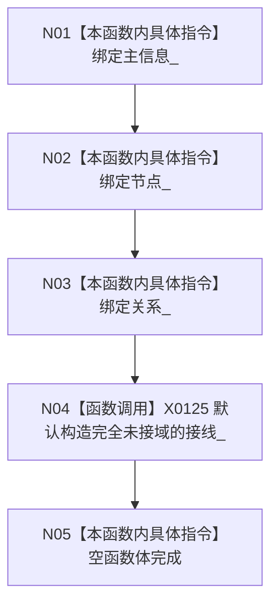

# CF-L5-0034 `需求服务::需求服务` 三仓库构造现状流程图

图类型：现状流程图；代码版本：`a48a70b2d678dea64dd8228adb4f26f0badd9506`
覆盖文件：`海中鱼巣/领域/需求服务.h:119-121,1043-1046`；唯一根函数：F0153
完整签名：`海中鱼巣::需求服务::需求服务(海中鱼巣::主信息仓库& 主信息, 海中鱼巣::节点仓库& 节点, 海中鱼巣::关系仓库& 关系)`
参数：三个非拥有可变仓库引用；返回结果：构造服务对象

项目调用 0，外部边界 X0125，未解析 0。三参重载会使要求接域的事务入口逻辑拒绝，但构造结果不显式标记能力模式。
