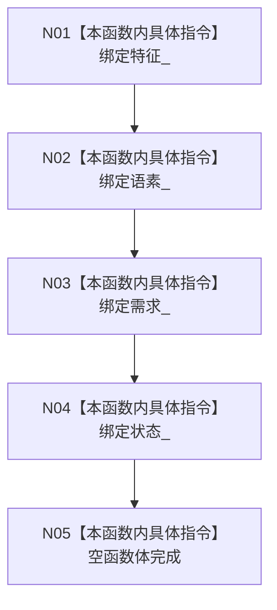

# CF-L5-0035 `需求初始化服务::需求初始化服务` 构造现状流程图

图类型：现状流程图；代码版本：`a48a70b2d678dea64dd8228adb4f26f0badd9506`
覆盖文件：`海中鱼巣/领域/初始化.需求.ixx:69-71,184-187`；唯一根函数：F0154
完整签名：`海中鱼巣::需求初始化服务::需求初始化服务(海中鱼巣::特征服务& 特征, 海中鱼巣::语素服务& 语素, 海中鱼巣::需求服务& 需求, 海中鱼巣::状态服务& 状态)`
参数：四个非拥有可变服务引用；返回结果：构造服务对象

项目调用、外部边界、未解析调用均为 0。构造不创建根需求，也不建立初始化锁或幂等状态。
