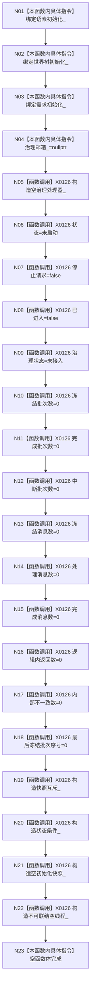

# CF-L5-0036 `自我线程::自我线程` 三依赖构造现状流程图

图类型：现状流程图；代码版本：`a48a70b2d678dea64dd8228adb4f26f0badd9506`
覆盖文件：`海中鱼巣/线程/自我线程.ixx:102-109,446-467`；唯一根函数：F0155
完整签名：`海中鱼巣::自我线程::自我线程(海中鱼巣::语素初始化服务& 语素初始化, 海中鱼巣::世界树初始化服务& 世界树初始化, 海中鱼巣::需求初始化服务& 需求初始化)`
参数：三个非拥有可变服务引用；返回结果：未启动、未接治理的自我线程对象

项目调用 0，外部边界 X0126，未解析 0。N22 只构造空 `std::thread`，不启动工作线程。
