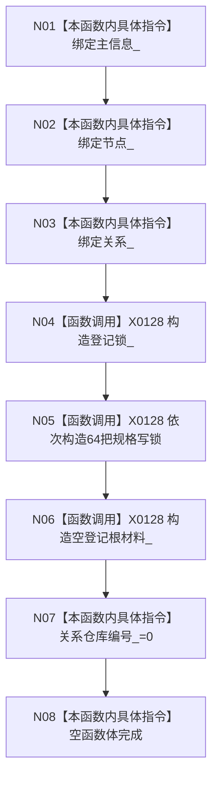

# CF-L5-0038 `方法服务::方法服务` 构造现状流程图

图类型：现状流程图；代码版本：`a48a70b2d678dea64dd8228adb4f26f0badd9506`
覆盖文件：`海中鱼巣/领域/方法服务.h:250-252,1297,1839-1845`；唯一根函数：F0157
完整签名：`海中鱼巣::方法服务::方法服务(海中鱼巣::主信息仓库& 主信息, 海中鱼巣::节点仓库& 节点, 海中鱼巣::关系仓库& 关系)`
参数：三个非拥有可变仓库引用；返回结果：构造服务对象

项目调用 0，外部边界 X0128，未解析 0。65 把锁只协调同一服务实例；构造不登记方法根。
