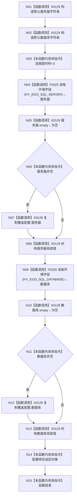

# CF-L5-0039 `SQL数据库适配::从环境创建配置` 现状流程图

图类型：现状流程图；代码版本：`a48a70b2d678dea64dd8228adb4f26f0badd9506`
覆盖文件：`海中鱼巣/适配/SQL数据库适配.cpp:314-323`；唯一根函数：F0158
完整签名：`海中鱼巣::SQL数据库配置 海中鱼巣::SQL数据库适配::从环境创建配置()`
参数：无；返回结果：独立拥有服务器、数据库字符串及3秒超时的配置

项目调用 F0325 两次，外部边界 X0129，未解析 0。空值、缺失和读取错误均保留默认；两字段不是同一原子环境快照。
