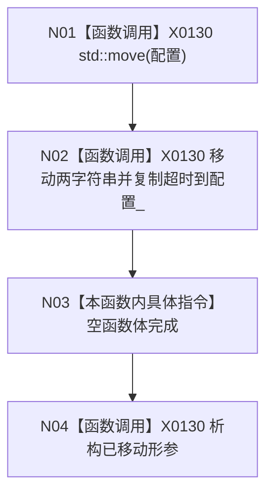

# CF-L5-0040 `SQL数据库适配::SQL数据库适配` 构造现状流程图

图类型：现状流程图；代码版本：`a48a70b2d678dea64dd8228adb4f26f0badd9506`
覆盖文件：`海中鱼巣/适配/SQL数据库适配.cpp:310-312`；唯一根函数：F0159
完整签名：`海中鱼巣::SQL数据库适配::SQL数据库适配(海中鱼巣::SQL数据库配置 配置)`
参数：按值配置；返回结果：独立拥有配置的适配对象

项目调用 0，外部边界 X0130，未解析 0。构造不校验配置、不连接数据库。
