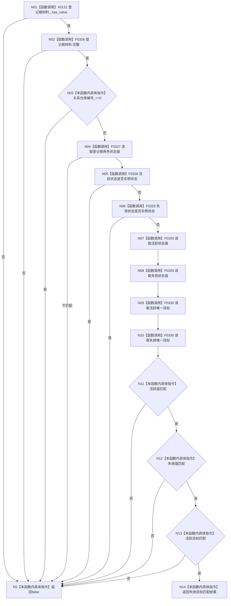

# CF-L5-0041 `方法服务::方法登记根完整_已加锁` 现状流程图

图类型：现状流程图；代码版本：`a48a70b2d678dea64dd8228adb4f26f0badd9506`
覆盖文件：`海中鱼巣/领域/方法服务.h:1336-1355`；唯一根函数：F0160
完整签名：`bool 海中鱼巣::方法服务::方法登记根完整_已加锁(const 海中鱼巣::状态服务& 状态) const`
参数：借用只读状态服务，调用方必须持有登记锁；返回结果：完整性布尔值

项目调用 F0326—F0330 共8次，外部边界 X0131，未解析 0。N07—N10 全部执行后才开始短路比较。
