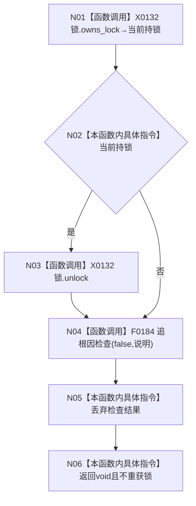

# CF-L5-0042 `方法服务::解锁并报告逻辑错误` 唯一锁实例现状流程图

图类型：现状流程图；代码版本：`a48a70b2d678dea64dd8228adb4f26f0badd9506`
覆盖文件：`海中鱼巣/领域/方法服务.h:1299-1305`；唯一根函数：F0161
完整签名：`void 海中鱼巣::方法服务::解锁并报告逻辑错误<std::unique_lock<std::shared_mutex>>(std::unique_lock<std::shared_mutex>& 锁, const wchar_t* 说明)`
参数：借用可变唯一锁和宽字符说明；返回结果：void

项目调用 F0184，外部边界 X0132，未解析 0。先解锁再诊断；函数不回滚既有结构。
