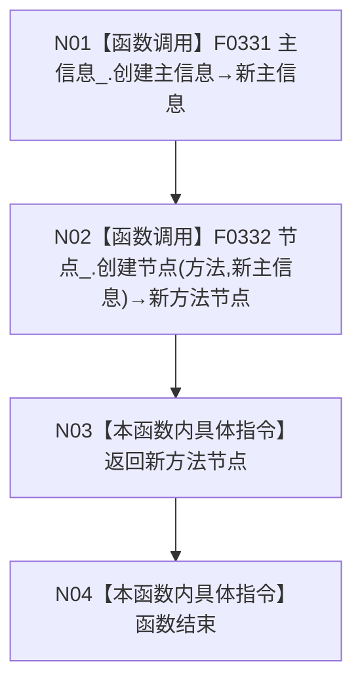

# CF-L5-0043 `方法服务::登记方法` 现状流程图

图类型：现状流程图；代码版本：`a48a70b2d678dea64dd8228adb4f26f0badd9506`
覆盖文件：`海中鱼巣/领域/方法服务.h:309-311`；唯一根函数：F0162
完整签名：`海中鱼巣::节点句柄 海中鱼巣::方法服务::登记方法()`
参数：无；返回结果：新方法节点句柄或空句柄

项目调用2次，外部边界0，未解析0。两次仓库写入没有共同事务；节点创建失败不会撤销已创建主信息。F0331 被调图已双向闭合：[主信息仓库创建主信息](../L6/CF-L6-0011_主信息仓库创建主信息_现状流程图.md)。
