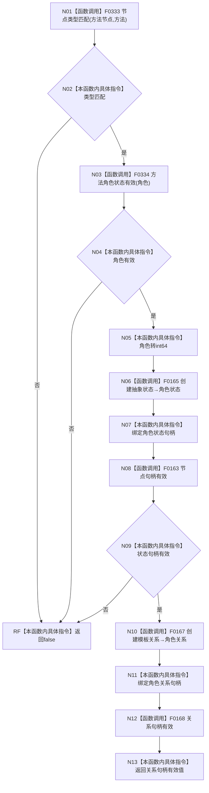

# CF-L5-0045 `方法服务::绑定方法角色状态` 现状流程图

图类型：现状流程图；代码版本：`a48a70b2d678dea64dd8228adb4f26f0badd9506`
覆盖文件：`海中鱼巣/领域/方法服务.h:1644-1654`；唯一根函数：F0164
完整签名：`bool 海中鱼巣::方法服务::绑定方法角色状态(海中鱼巣::节点句柄 方法节点, 海中鱼巣::方法角色状态 角色, 海中鱼巣::状态服务& 状态)`
参数：按值节点句柄与角色、借用可变状态服务；返回结果：模板关系句柄是否形态有效
本批被调图：[F0333 方法服务节点类型匹配](../L6/CF-L6-0013_方法服务节点类型匹配_现状流程图.md)、[F0334 方法服务方法角色状态有效](../L6/CF-L6-0014_方法服务方法角色状态有效_现状流程图.md)

项目调用6个唯一函数，外部边界0，未解析0。状态创建成功而关系创建失败时不回滚孤立状态。
