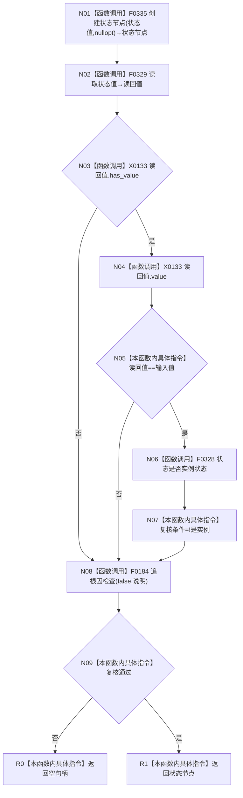

# CF-L5-0046 `状态服务::创建抽象状态` 现状流程图

图类型：现状流程图；代码版本：`a48a70b2d678dea64dd8228adb4f26f0badd9506`
覆盖文件：`海中鱼巣/领域/状态服务.h:157-165`；唯一根函数：F0165
完整签名：`海中鱼巣::节点句柄 海中鱼巣::状态服务::创建抽象状态(std::int64_t 状态值)`
参数：按值状态值；返回结果：复核通过的状态节点或空句柄

项目调用4个唯一函数，外部边界 X0133，未解析0。复核失败不撤销已创建状态结构。已完成被调图双向引用：[F0328 状态服务状态是否实例状态](../L6/CF-L6-0008_状态服务状态是否实例状态_现状流程图.md)、[F0329 状态服务读取状态值](../L6/CF-L6-0009_状态服务读取状态值_现状流程图.md)。
