# CF-L5-0047 `关系仓库::创建关系` 现状流程图

图类型：现状流程图；代码版本：`a48a70b2d678dea64dd8228adb4f26f0badd9506`
覆盖文件：`海中鱼巣/核心/关系仓库.cpp:184-275`；唯一根函数：F0167
完整签名：`海中鱼巣::关系句柄 海中鱼巣::关系仓库::创建关系(海中鱼巣::关系类型 类型, 海中鱼巣::节点句柄 源节点, 海中鱼巣::节点句柄 目标节点, std::int64_t 顺序号)`
参数：四项按值关系材料；返回结果：新关系句柄或空句柄

```mermaid
flowchart TD
 N01["N01【函数调用】X0134 构造两个空许可optional"] --> N02{"N02【函数调用】F0336 事务接线_.已接域"}
 N02 -->|否| N09["N09【函数调用】F0341 关系类型已定义"]
 N02 -->|是| N03["N03【函数调用】F0337 读取当前关系令牌"] -->|已有令牌| N09
 N03 -->|无令牌| N04["N04【函数调用】U0001 经函数指针取得共享许可"] --> N05["N05【函数调用】X0134 emplace自动许可"]
 N05 --> N05A["N05A【函数调用】F0345 析构已移空的取得许可临时返回对象"] --> N06{"N06【函数调用】F0338 许可有效"} -->|否| R0["R0【本函数内具体指令】返回空句柄"]
 N06 -->|是| N07["N07【函数调用】F0339 读取令牌"] --> N08["N08【函数调用】F0340 构造关系令牌范围"]
 N08 --> N09 --> N10{"N10【本函数内具体指令】关系类型有效"} -->|否| D1["D1【本函数内具体指令】当前正式配置下容错宏展开为空且不求值宏实参"] --> R0
 N10 -->|是| N11["N11【函数调用】F0163 源节点句柄有效"] -->|否| D2["D2【本函数内具体指令】当前正式配置下容错宏展开为空且不求值宏实参"] --> R0
 N11 -->|是| N12["N12【函数调用】F0163 目标节点句柄有效"] --> N13{"N13【本函数内具体指令】两端句柄有效"} -->|否| D2
 N13 -->|是| N14["N14【函数调用】F0343 源节点有效_"] -->|否| D3["D3【本函数内具体指令】当前正式配置下容错宏展开为空且不求值宏实参"] --> R0
 N14 -->|是| N15["N15【函数调用】F0343 目标节点有效_"] --> N16{"N16【本函数内具体指令】两端节点有效"} -->|否| D3
 N16 -->|是| N17{"N17【本函数内具体指令】生命周期证据顺序号在40至46"} -->|不适用或有效| N18{"N18【本函数内具体指令】类型是任务方法选择"}
 N17 -->|无效| R0
 N18 -->|是| N19["N19【函数调用】F0337 读取当前令牌"] --> N20["N20【函数调用】F0346或F0190 读取源节点"] --> N21["N21【函数调用】F0346或F0190 读取目标节点"] --> N22{"N22【本函数内具体指令】顺序30且源目标类型匹配"} -->|否| R0
 N22 -->|是| N23
 N18 -->|否| N23{"N23【本函数内具体指令】类型是方法动作场景"}
 N23 -->|是| N24["N24【函数调用】F0337 读取当前令牌"] --> N25["N25【函数调用】F0346或F0190 读取源节点"] --> N26["N26【函数调用】F0346或F0190 读取目标节点"] --> N27{"N27【本函数内具体指令】顺序1或2且源目标类型匹配"} -->|否| R0
 N27 -->|是| N28
 N23 -->|否| N28{"N28【本函数内具体指令】类型是用途观察证据角色"}
 N28 -->|是| N29["N29【函数调用】F0337 读取当前令牌"] --> N30["N30【函数调用】F0346或F0190 读取源节点"] --> N31["N31【函数调用】F0346或F0190 读取目标节点"]
 N31 --> N32{"N32【函数调用】F0347与F0348 校验角色及目标类型"} -->|否| R0
 N32 -->|是| N33
 N28 -->|否| N33["N33【函数调用】X0134 取得仓库独占锁"] --> N34["N34【函数调用】X0134 构造空实际状态optional"] --> N35["N35【函数调用】X0134 构造空结算状态optional"]
 N35 --> N36["N36【函数调用】X0134 遍历关系表并绑定现有记录"] --> N37{"N37【本函数内具体指令】记录有效且类型相同"} -->|否/下一条| N36
 N37 -->|是| N38{"N38【本函数内具体指令】观察类型同源"} -->|否/下一条| N36
 N38 -->|是| N39{"N39【本函数内具体指令】观察顺序重复"} -->|是| R0
 N39 -->|否| N40["N40【本函数内具体指令】顺序9记录实际状态"] --> N41["N41【本函数内具体指令】顺序15记录结算状态"] --> N36
 N38 -->|非观察类型| N42{"N42【本函数内具体指令】生命周期同源同序重复"} -->|是| R0
 N42 -->|否/下一条| N43{"N43【本函数内具体指令】任务方法选择同源重复"} -->|是| R0
 N43 -->|否/下一条| N44{"N44【本函数内具体指令】动作场景同源同序重复"} -->|是| R0
 N44 -->|否/下一条| N45{"N45【本函数内具体指令】一般同源同目标重复"} -->|是| R0
 N45 -->|否| N46{"N46【本函数内具体指令】普通父子目标已有父"} -->|是| R0
 N46 -->|否/下一条| N36
 N36 -->|扫描结束| N47{"N47【本函数内具体指令】观察类型"}
 N47 -->|是| N48{"N48【本函数内具体指令】顺序30或31匹配实际状态"} -->|否| R0
 N48 -->|是或不适用| N49{"N49【本函数内具体指令】顺序32匹配结算状态"} -->|否| R0
 N49 -->|是或不适用| N50["N50【本函数内具体指令】读取并递增关系编号"]
 N47 -->|否| N50 --> N51["N51【本函数内具体指令】默认构造关系记录"] --> N52["N52【本函数内具体指令】写关系编号"]
 N52 --> N53["N53【本函数内具体指令】写类型"] --> N54["N54【本函数内具体指令】写源节点"] --> N55["N55【本函数内具体指令】写目标节点"]
 N55 --> N56["N56【本函数内具体指令】写顺序号"] --> N57["N57【本函数内具体指令】写版本1"] --> N58["N58【本函数内具体指令】写有效状态"]
 N58 --> N59["N59【函数调用】X0134 关系表_.emplace"] --> N60["N60【本函数内具体指令】返回新关系句柄"]
 R0 --> N61["N61【函数调用】F0344/F0345及X0134 逆序释放锁、令牌范围和许可"]
 N60 --> N61
```

静态项目 callee 15 个唯一身份；动态调用 U0001 尚未唯一解析，许可释放动态调用 U0002 归属 F0631。外部边界 X0134。所有拒绝返回空句柄。

本批已完成被调图双向引用：[F0336 结构事务接线已接域](../L6/CF-L6-0016_结构事务接线已接域_现状流程图.md)、[F0337 读取当前关系令牌](../L6/CF-L6-0017_读取当前关系令牌_现状流程图.md)、[F0338 结构事务许可有效](../L6/CF-L6-0018_结构事务许可有效_现状流程图.md)、[F0339 结构事务许可读取令牌](../L6/CF-L6-0019_结构事务许可读取令牌_现状流程图.md)、[F0340 关系令牌范围构造](../L6/CF-L6-0020_关系令牌范围构造_现状流程图.md)、[F0341 关系类型已定义](../L6/CF-L6-0021_关系类型已定义_现状流程图.md)、[F0343 关系仓库节点有效](../L6/CF-L6-0022_关系仓库节点有效_现状流程图.md)、[F0344 关系令牌范围析构](../L6/CF-L6-0023_关系令牌范围析构_现状流程图.md)、[F0345 结构事务许可析构](../L6/CF-L6-0024_结构事务许可析构_现状流程图.md)、[F0346 节点仓库读取节点令牌重载](../L6/CF-L6-0025_节点仓库读取节点令牌重载_现状流程图.md)。
