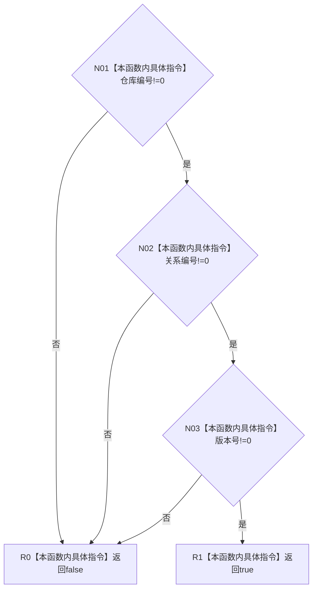

# CF-L5-0048 `句柄有效(关系句柄)` 现状流程图

图类型：现状流程图；代码版本：`a48a70b2d678dea64dd8228adb4f26f0badd9506`
覆盖文件：`海中鱼巣/核心/句柄.h:121-125,135-137`；唯一根函数：F0168
完整签名：`bool 海中鱼巣::句柄有效(const 海中鱼巣::关系句柄& 句柄)`
参数：只读借用关系句柄；返回结果：三个身份字段是否均非零

项目调用、外部边界、未解析调用均为0。与F0163节点句柄重载身份不同。
