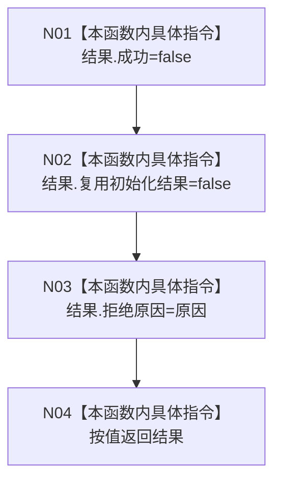

# CF-L5-0049 `自我线程::拒绝` 现状流程图

图类型：现状流程图；代码版本：`a48a70b2d678dea64dd8228adb4f26f0badd9506`
覆盖文件：`海中鱼巣/线程/自我线程.ixx:272-274`；唯一根函数：F0169
完整签名：`海中鱼巣::自我线程操作结果 海中鱼巣::自我线程::拒绝(海中鱼巣::自我线程拒绝原因 原因)`
参数：按值拒绝原因；返回结果：失败且不复用的结构化结果

项目调用、外部边界、未解析调用均为0。函数不阻止调用方传入“无”原因。
