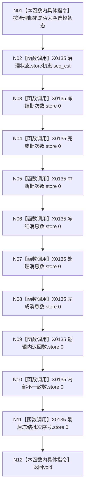

# CF-L5-0050 `自我线程::重置治理读数` 现状流程图

图类型：现状流程图；代码版本：`a48a70b2d678dea64dd8228adb4f26f0badd9506`
覆盖文件：`海中鱼巣/线程/自我线程.ixx:276-289,454-463`；唯一根函数：F0170
完整签名：`void 海中鱼巣::自我线程::重置治理读数()`
参数：无；返回结果：void

项目调用0，外部边界 X0135，未解析0。10次独立seq_cst写不构成整体原子快照。
