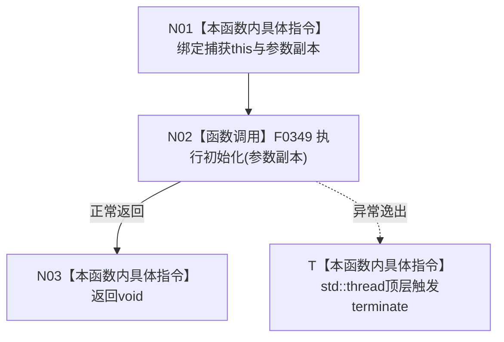

# CF-L5-0051 自我线程启动 lambda 现状流程图

图类型：现状流程图；代码版本：`a48a70b2d678dea64dd8228adb4f26f0badd9506`
覆盖文件：`海中鱼巣/线程/自我线程.ixx:204-206`；唯一根函数：F0171
完整签名：`void 海中鱼巣::自我线程::启动(const 海中鱼巣::自我根需求初始化参数&)::<lambda@自我线程.ixx:204-206>::operator()() const`
参数：无显式参数；closure拥有参数副本并借用裸this；返回结果：void

项目调用 F0349，直接外部边界0，未解析0。closure不拥有自我线程对象；工作线程异常不被启动调用线程的catch捕获。被调图：[F0349 自我线程执行初始化](../L6/CF-L6-0028_自我线程执行初始化_现状流程图.md)。
