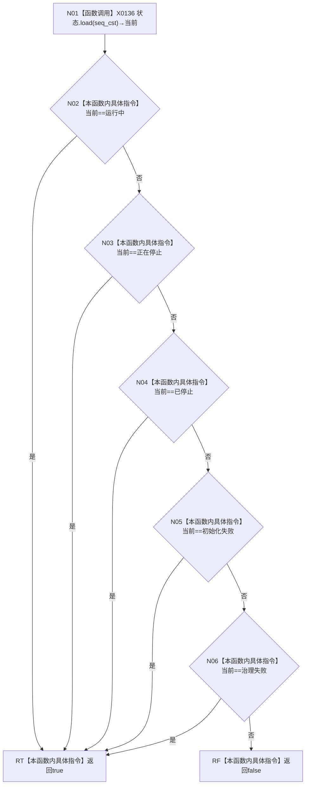

# CF-L5-0052 等待初始化完成谓词现状流程图

图类型：现状流程图；代码版本：`a48a70b2d678dea64dd8228adb4f26f0badd9506`
覆盖文件：`海中鱼巣/线程/自我线程.ixx:217-224`；唯一根函数：F0172
完整签名：`bool 海中鱼巣::自我线程::等待初始化完成(std::chrono::milliseconds) const::<lambda@自我线程.ixx:217-224>::operator()() const`
参数：无；closure借用裸this；返回结果：状态是否进入五种就绪/终止状态

项目调用0，外部边界 X0136，未解析0。每次谓词只读取一次原子状态；正在停止也会立即满足。
