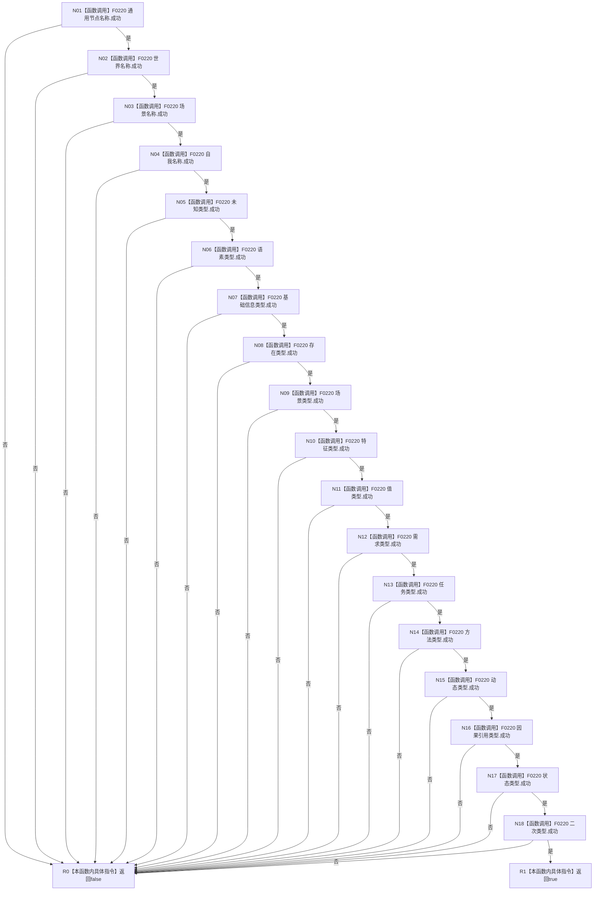

# CF-L5-0053 `语素初始化结果::成功` 现状流程图

图类型：现状流程图；代码版本：`a48a70b2d678dea64dd8228adb4f26f0badd9506`
覆盖文件：`海中鱼巣/领域/初始化.语素.ixx:47-86`；唯一根函数：F0173
完整签名：`bool 海中鱼巣::语素初始化结果::成功() const`
参数：无；只读this；返回结果：18个固定显示项是否全部成功

项目调用同一F0220共18次，外部边界0，未解析0。函数不验证18项角色唯一性、文本语义或初始化代次。
