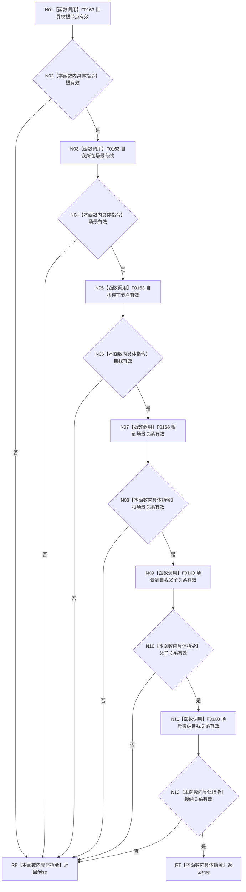

# CF-L5-0054 `世界树初始化结果::成功` 现状流程图

图类型：现状流程图；代码版本：`a48a70b2d678dea64dd8228adb4f26f0badd9506`
覆盖文件：`海中鱼巣/领域/初始化.世界树.ixx:24-40`；唯一根函数：F0174
完整签名：`bool 海中鱼巣::世界树初始化结果::成功() const`
参数：无；只读this；返回结果：六个句柄是否均形态有效

项目调用F0163三次、F0168三次；外部边界0，未解析0。自我相对坐标完全不参与成功判定。
