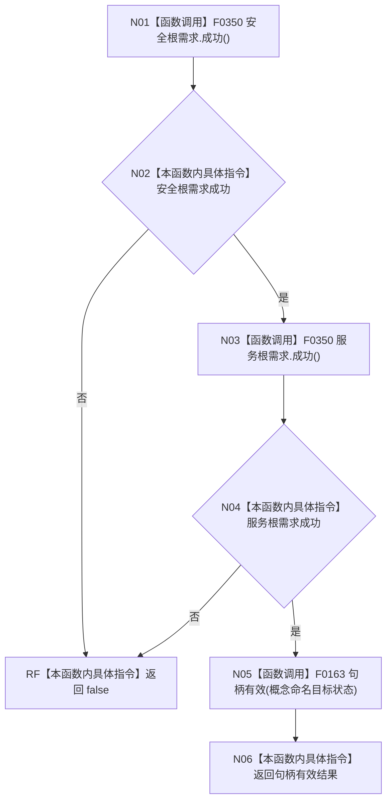

# CF-L5-0055 `自我根需求初始化结果::成功` 现状流程图

图类型：现状流程图；代码版本：`a48a70b2d678dea64dd8228adb4f26f0badd9506`
覆盖文件：`海中鱼巣/领域/初始化.需求.ixx:57-64`；唯一根函数：F0175
完整签名：`bool 海中鱼巣::自我根需求初始化结果::成功() const`
参数：无；只读 `this`；返回结果：两个单根需求结果与概念命名目标状态句柄是否均形态有效

项目源码调用为 F0350 两次、F0163 一次，严格遵循 `&&` 从左到右短路；外部边界 0，未解析调用 0。返回 `true` 只证明字段自身的形态检查通过，不证明两个根需求角色不同、跨字段语义一致或句柄仍是仓库当前事实。
