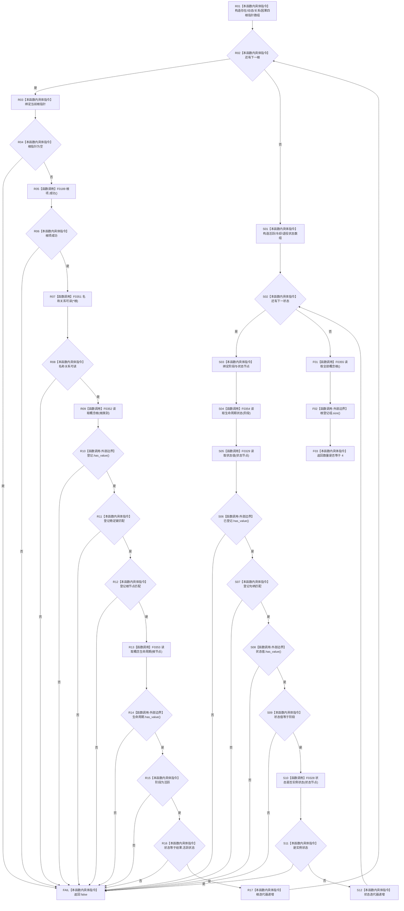

# CF-L5-0056 `概念图初始化服务::根结构仍可读` 现状流程图

图类型：现状流程图；代码版本：`a48a70b2d678dea64dd8228adb4f26f0badd9506`
覆盖文件：`海中鱼巣/领域/初始化.概念图.ixx:219-257`；唯一根函数：F0176
完整签名：`bool 海中鱼巣::概念图初始化服务::根结构仍可读(const 海中鱼巣::概念图初始化结果& 结果) const`
参数：只读借用 `结果`；只读 `this`；返回结果：四根、名称关系、生命周期状态及根总数的分次读回是否匹配

项目源码静态调用点 8 个；标准库外部边界包括数组/配对构造、范围迭代、`optional` 访问、`vector::size` 与临时对象析构；未解析调用 0。各次仓库/服务读取不是统一事务快照，`true` 不证明这些材料曾在同一时刻共同成立。已完成被调图双向引用：[F0328 状态服务状态是否实例状态](../L6/CF-L6-0008_状态服务状态是否实例状态_现状流程图.md)、[F0329 状态服务读取状态值](../L6/CF-L6-0009_状态服务读取状态值_现状流程图.md)。
